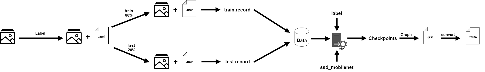

# CalculatoAR

CalculatoAR is a augmented reality, android app to detect and solve mathematic formulas in a live video stream.
The app uses tensorflow to detect the formulas and mxParser to solve the detected formulas. OpenCV is used to calculate the current homography.
The minimum SDK-Version is 21.

## Tensorflow

1. DataSet 
   We created our own DataSet with roundabout 400 images. Each image needed to labled.
2. Record 
   With the labeled DataSet we were able to create a record for a training and testing set. This files included data of the positioning and the name of the labels. With this files we trained our model
3. Single-Shot-Detection 
   We chose a single shot detection for out mobile app. It is fast and works perfectly with tensorflow lite.
4. Checkpoints 
   In the process of training tensorflow creates chseckpoints with saved weight-values which were used for the neural network.
5. Graph 
   We created a graph with the latest checkpoint.
6. Tensorflow lite 
   Tensorflow lite is the way to go for a fast mobile app. To use it the *.pb graph needs to be formatted to lite or tflite file.

All scripts for formatting and training can be found on the official tensorflow repository

## mxParser
mxParser is a math expression parser for android. It is easy to use and fast. It runs on the device locally, no api needed. The applicaton uses it to solve the detected formulas.

## OpenCV
OpenCV is an open source computer vision and machine learning software library. It is able to detect and compute a homography between two images.

## Developers
Christoph Schimpf 
Niklas Hartinger 
Sophie Ross 
Dennis Preis 

## Credit
Special credit to Daniel Vogel for his support.